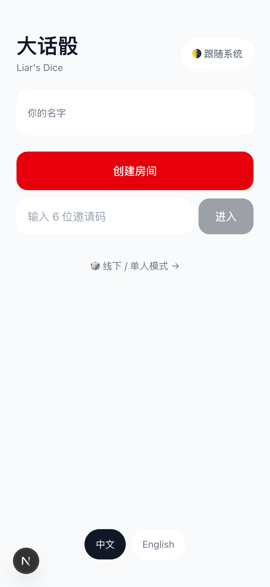
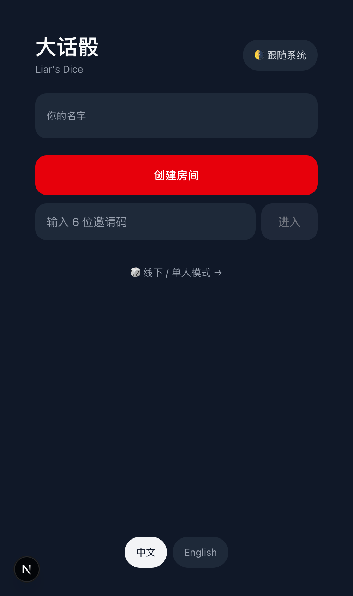

# 大话骰 (Liar's Dice)

A 2-8 player Liar's Dice web app with animated 2D dice, gyroscope shake-to-roll, and dark/light dual mode in a clean neutral-gray + red design language (shared with the WeChat mini-program sibling). Mobile-first, realtime, server-authoritative.

<p align="center">
  
  
</p>
<p align="center"><em>Same screen, light and dark mode (follow-system + manual override).</em></p>

**Live**: https://dahua-dice.vercel.app (public — only per-deploy hash URLs are SSO-walled)

## Features

- 🎲 **Animated 2D dice** — a lightweight DOM/CSS renderer (`components/dice/Dice2D`) shows your own hand and tumbles on each roll (GPU `transform`/`opacity` only, reduced-motion aware), styled with plain Tailwind light/dark classes — no WebGL/Three.js. The roll is always server-authoritative (`crypto.randomInt`); the animation is decorative.
- 📱 **Mobile-first** with gyroscope shake-to-roll (DeviceMotion API, iOS permission flow), `100dvh` safe-area layout, native share-sheet invite links.
- 🎨 **Dark/light dual mode** — follows the system by default with a manual 3-state override (system / light / dark, persisted), in the same minimal design language as the WeChat mini-program sibling: neutral grays, one red accent, big readable type.
- 🧑‍🤝‍🧑 **Player avatars** — pick from 12 glyphs or a numbered seat badge in the lobby; rendered as per-player tinted badges across lobby, turn ring, and reveal.
- 🌐 **i18n** — zh-CN default + en, via `next-intl`.
- 🔄 **Realtime multiplayer** via Upstash Redis + Vercel Fluid Compute SSE pipe (`/subscribe/{channel}` transparent stream). On reconnect the client refetches full room state (SSE `onopen` → refetch, plus a 3s safety poll), so a brief drop never loses sync.
- 🎲 **Offline / solo mode** (`/solo`) — for playing face-to-face, each phone is a fair local dice cup: roll (button or shake), see your own hand, cover/peek to hide it across the table; no room, no network. Rolls use `crypto.getRandomValues` locally (solo has no protocol adversary, unlike the server-authoritative multiplayer game).
- 🔒 **Server-authoritative gameplay** — challenge / 劈 / 通杀 / round resolution runs in a **pure, unit-tested engine** (`lib/game-engine/round.ts`) computed in Node, then committed atomically via version-CAS Lua; bids/joins are atomic Lua mutations. Inputs are Zod-validated at the boundary and rate-limited (30/min/session); dice rolled with `crypto.randomInt`; private hands are server-only and auth-gated per player (never broadcast before reveal).
- 🎮 **Full ruleset** — standard Liar's Dice + 斋 (close-call) + 1点万能 + 叫1必斋 + the 中式扩展 (劈 challenge a non-adjacent bidder / 反劈 bite-back / 通杀 sweep-all) + Palifico (the one-die opener round). All toggleable in the lobby and enforced end-to-end.
- ♿ **Accessibility** — full keyboard play (1-6 face · ±count · Enter bid · Space-to-challenge with confirm), ARIA live regions for turns/bids/reveal, `prefers-reduced-motion` static dice, themed focus rings, drawer focus-trap, ≥44px touch targets.
- 🎵 **Audio** — a real CC0 dice-settle sample (always on) plus an optional ffmpeg-synthesized Howler sprite pack behind `NEXT_PUBLIC_AUDIO_ENABLED` (off by default). Regenerate with `node scripts/audio/generate-sprites.mjs`.

## Build & run locally

```bash
pnpm install
vercel env pull .env.local --environment=production   # requires link to panpanmao/dahua-dice
pnpm dev
# open http://localhost:3000
```

## Test

```bash
pnpm test            # 83 unit + integration tests (game engine, validation, round resolution, hand summary)
pnpm test:coverage   # vitest + @vitest/coverage-v8
pnpm e2e             # Playwright: happy-path, reconnect, extensions, solo, 劈, palifico, axe a11y — chromium + webkit (mobile Safari)
PLAYWRIGHT_PORT=3100 pnpm e2e   # use a free port if :3000 is taken by another dev server
```

The e2e suite (32 tests across 2 projects) drives two browser contexts through create → join → start → bid → counter-bid → challenge → reveal → next round (incl. asserting each player sees their own dice), a **complete game to elimination → final results → rematch → lobby**, a 通杀 (sweep) extension journey, a mid-game reload re-sync, the **offline / solo dice-cup** flow (roll · cover/peek · dice-count), and `@axe-core` WCAG A/AA scans of the home / lobby / bidding / solo screens. It auto-starts a dev server (override the port with `PLAYWRIGHT_PORT`). First run needs the browsers: `pnpm exec playwright install chromium webkit`.

## Deploy

```bash
vercel --prod --scope panpanmao   # personal scope — never the computelabs team
```

## Project structure

- [Design spec](docs/specs/2026-05-21-dahua-dice-design.md) — 22 sections: screens / data model / state machine / a11y (§12 visual system rewritten 2026-06-12 for the wxapp-aligned redesign)
- [Implementation plan](docs/plans/2026-05-21-dahua-dice-plan.md) — 12 phases, ~60 tasks
- [Research](docs/research/) — game rules / Upstash multiplayer / R3F+Rapier dice / Howler audio
- `CLAUDE.md` — 60-second orientation for AI agents working in this repo

## Tech stack

Next.js 16 (App Router, Turbopack) · React 19 · TypeScript · Tailwind CSS v4 · next-intl · zod · @upstash/redis · howler · Biome v2 · Vitest · Playwright + @axe-core/playwright
