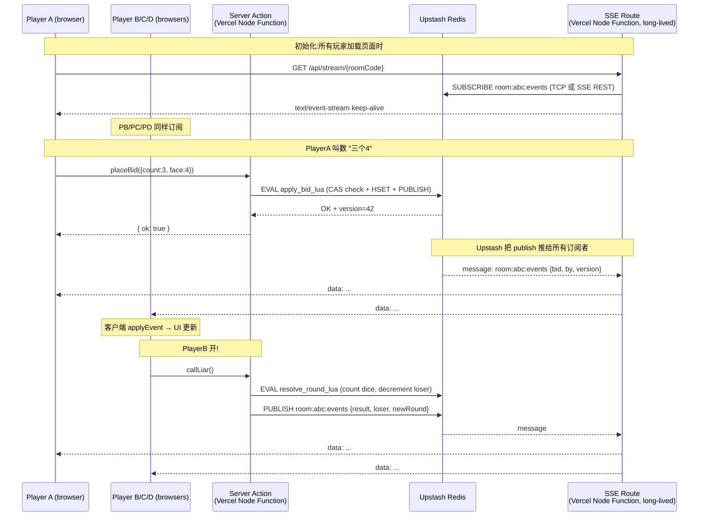

# 大话骰 4-8人 Web Demo — 多人实时同步方案调研

**Stack 假设**: Next.js 16 (App Router) + Vercel 部署 + 4-8 玩家/房间 + 回合制 (5-15s/动作) + demo 级流量

**TL;DR**:

1. **Upstash Redis 完全可行**。但有一个核心 gotcha — `@upstash/redis` HTTP SDK 可以 `publish()`,**不能**直接 `subscribe()`。订阅端要么用 Upstash REST 的原生 `/subscribe/{channel}` SSE endpoint(`fetch + Accept: text/event-stream`),要么用 `ioredis` TCP 客户端在 Vercel Node runtime + Fluid Compute 下跑。两条路线 demo 都能 work。
2. **推荐方案**: **Upstash Redis 状态存储 + Vercel Functions SSE (Fluid Compute) + 原生 `/subscribe` REST endpoint 做 fan-out**。具体见 §7。
3. **唯一会让我换方案的情况**: 房间数 >100、并发玩家 >1000、或想要真 sub-100ms 延迟的实时游戏 — 这种应该走 Partykit/Durable Objects。回合制 demo 不是。

---

## 1. Upstash Redis + Vercel 可行性逐条核查

### 1.1 Vercel Functions 执行时限 vs SSE 长连接

| Plan      | 默认 Function maxDuration  | 上限       |
|-----------|---------------------------|-----------|
| Hobby     | **300s** (旧版 60s,已上调) | 300s      |
| Pro       | 300s                      | **800s**  |
| Enterprise| 300s                      | 800s      |

(以上数据来自 Vercel 2025-04 changelog `Higher defaults and limits for Vercel Functions running Fluid compute`。)

**结论**: Hobby tier 5 分钟、Pro tier 13 分钟 — 足够 demo 一整局大话骰(典型局 5-10 分钟)。**SSE 必须配合 Fluid Compute 开启**(Fluid 是新建项目默认开)。

Fluid Compute 的 Active CPU 计费意味着 SSE 长连接在等 Redis 事件时(I/O wait)**几乎不计 CPU 费**,只计较低的 Provisioned Memory(< CPU 单价的 10%)。这是 2025 Q1 的关键变化,过去 wall-clock 计费让 SSE 在 Vercel 上经济性极差。

### 1.2 Vercel Edge Functions vs Node Functions for SSE

| 维度                     | Edge Functions          | Node Functions (Fluid Compute)  |
|-------------------------|------------------------|--------------------------------|
| 全球低延迟              | 是                     | 区域固定                       |
| 支持 TCP (ioredis)      | **否**                 | **是**                         |
| 支持 SSE / ReadableStream| 是                    | 是                             |
| 支持 `@upstash/redis` HTTP| 是                   | 是                             |
| maxDuration             | 25s (Edge limit)       | 300/800s                       |
| 推荐                    | 仅做 publish/写操作    | 跑 SSE long-lived 订阅端       |

**结论**: SSE 端必须用 Node Function (有 ioredis TCP 选项 + 更长 maxDuration)。Edge 只适合做 publish/short reads。

### 1.3 Upstash Pub/Sub 在 Vercel 上怎么消费 — **核心 gotcha**

`@upstash/redis` HTTP SDK 的 API 表面:

```ts
import { Redis } from '@upstash/redis'
const redis = Redis.fromEnv()

// 可以 publish
await redis.publish('room:abc:events', JSON.stringify({...}))

// subscribe() 在 HTTP SDK 里有方法签名,但底层依赖一个 streaming HTTP 连接,
// Vercel Node runtime + Fluid Compute 下能 work,但不被广泛推荐为 SSE fan-out 路径
```

**两条实际可行的订阅路径**:

#### 路径 A: ioredis TCP + Vercel Node Function (推荐 production)

```ts
// app/api/stream/[roomId]/route.ts
import Redis from 'ioredis'

export const dynamic = 'force-dynamic'
export const runtime = 'nodejs'   // 必须,不能用 edge
export const maxDuration = 300    // Hobby max; Pro 可以拉到 800

export async function GET(req: Request, { params }: { params: { roomId: string }}) {
  const sub = new Redis(process.env.UPSTASH_REDIS_TCP_URL!) // 注意是 redis:// 不是 https://
  const encoder = new TextEncoder()

  const stream = new ReadableStream({
    start(controller) {
      sub.subscribe(`room:${params.roomId}:events`)
      sub.on('message', (_ch, msg) => {
        controller.enqueue(encoder.encode(`data: ${msg}\n\n`))
      })
      req.signal.addEventListener('abort', () => {
        sub.disconnect()
        controller.close()
      })
    }
  })

  return new Response(stream, {
    headers: {
      'Content-Type': 'text/event-stream',
      'Cache-Control': 'no-cache, no-transform',
      'Connection': 'keep-alive',
      'X-Accel-Buffering': 'no',  // 防止 Nginx/CDN 缓冲(踩过的坑)
    },
  })
}
```

Upstash 数据库面板上同时给两套 URL:HTTPS REST 和 `redis://` TCP。Node runtime + ioredis 用后者。

#### 路径 B: Upstash 原生 REST `/subscribe` SSE endpoint(零依赖,推荐 demo)

Upstash REST API 直接暴露了 SSE 订阅端,响应本身就是 SSE 格式。你可以做的是**把 Upstash 的 SSE 流转发给客户端**,中间不需要 Redis client lib:

```ts
// app/api/stream/[roomId]/route.ts
export const dynamic = 'force-dynamic'
export const runtime = 'nodejs'
export const maxDuration = 300

export async function GET(req: Request, { params }: { params: { roomId: string }}) {
  const upstashUrl = `${process.env.UPSTASH_REDIS_REST_URL}/subscribe/room:${params.roomId}:events`
  const upstream = await fetch(upstashUrl, {
    headers: {
      Authorization: `Bearer ${process.env.UPSTASH_REDIS_REST_TOKEN}`,
      Accept: 'text/event-stream',
    },
    signal: req.signal,  // 客户端断开时也断开 upstream
  })

  // 直接把 upstash 的 SSE 流透传给浏览器(同样是 SSE 格式)
  return new Response(upstream.body, {
    headers: {
      'Content-Type': 'text/event-stream',
      'Cache-Control': 'no-cache, no-transform',
      'Connection': 'keep-alive',
      'X-Accel-Buffering': 'no',
    },
  })
}
```

**路径 B 是 demo 最香的写法**:零额外依赖、Edge runtime 都能跑(因为不用 TCP)、代码量最少。**唯一缺点**:Upstash 的 SSE message 格式是 `data: message,<channel>,<payload>` 而不是干净的 JSON,客户端要做轻量解析;如果你需要在转发前做任何 server-side enrichment(比如 player auth filter),那就回到路径 A 自己中转。

**Demo 阶段建议路径 B,production 阶段换路径 A**。

### 1.4 Upstash Free Tier(2025 新政,已更新)

| 资源                       | 旧 Free                   | **新 Free (2025-03-12 起)** |
|---------------------------|---------------------------|---------------------------|
| Commands                  | 10K / 天                   | **500K / 月** (~16K/天)    |
| Storage                   | 256 MB                    | 256 MB                    |
| Bandwidth                 | 50 GB / 月                | **200 GB / 月 free**      |
| Connections (TCP soft cap)| ~1000                     | ~1000                     |
| Databases per account     | 1                         | 1 free (10 total at $0.5/mo each) |

**Demo 流量预估**:8 玩家 × 一局 ~30 actions × 每 action 4 ops (read state / write state / publish / log) = ~960 commands/局。1 万局/月才到 ~10M commands — 远超 free tier,但 500K commands/月对前 50 局足够,之后切 pay-as-you-go ($0.20 / 100K) 也只是 ~$2/月。

**SSE 长连接对 commands 几乎零消耗**(订阅是一次性建立连接,后续 publish 才计 commands)。

### 1.5 Vercel KV 是 Upstash 吗?

是。Vercel 在 2024-12 把所有 Vercel KV 自动迁移到 Upstash Redis,Vercel KV 这个品牌已下线。新项目从 Vercel Marketplace 直接装 "Upstash Redis" integration 即可,环境变量自动注入。**迁移路径 = 没有迁移路径,因为它就是 Upstash**。

---

## 2. 五方案对比(回合制 + 4-8 玩家场景)

| 维度 \ 方案 | A: Upstash SSE | B: Upstash 轮询 | C: Pusher / Ably | D: Partykit / DO | E: Supabase Realtime |
|---|---|---|---|---|---|
| **延迟**(目标 < 500ms 即可) | 100-300ms | 1-2s | 50-150ms | 30-100ms | 100-200ms |
| **复杂度** | 中(SSE + Redis schema) | 低(只有 GET) | 低(SDK 极简) | 中(新概念 DO) | 中(Postgres + RLS) |
| **成本(8 玩家 demo)** | $0 (free tier) | $0 (free tier,但 commands 翻 5-10×) | $0 free / $49 起 | $0 (Cloudflare free) | $0 / $25 Pro |
| **Vercel 原生度** | 高(Upstash 在 Marketplace) | 高 | 中(外部服务) | 低(部署到 Cloudflare) | 中(Marketplace 有) |
| **断线重连** | EventSource 自动重连;状态需 GET 同步 | 天然(每次都新请求) | SDK 内置 | SDK 内置 | SDK 内置 |
| **额外服务** | 仅 Upstash | 仅 Upstash | + Pusher/Ably | + Cloudflare | + Supabase |
| **Demo 友好度** | ★★★★ | ★★★★★ | ★★★ | ★★ | ★★★ |

### 各方案推荐 / 不推荐场景

#### A. Upstash Redis Pub/Sub + Vercel Functions SSE
- 推荐: 回合制游戏、几十到几百个并发 room、Vercel 单平台部署、demo 想要"真实时"体感但又不想引入第二个服务
- 不推荐: 需要 server-side 持久 in-memory 房间状态(比如复杂 game logic);上千并发 SSE 连接(Vercel 单 region function 的实例并发上限会成为瓶颈)

#### B. Upstash Redis 状态 + 客户端 1-2s 轮询
- 推荐: 极简 demo、把所有复杂度推到客户端、连 SSE 都不想写
- 不推荐: 想要 < 1s 延迟体验、想省 Redis commands 配额(轮询会把 commands 用量打 10-50 倍)

#### C. Pusher Channels / Ably
- 推荐: 不想自己写 fan-out 逻辑、要 presence/typing indicators 等开箱功能、未来要支持移动端原生 SDK
- 不推荐: 想保持 Vercel 单服务、Demo 阶段(Free tier 够用但额外 vendor)、不喜欢 WebSocket 多 vendor 的运维心智负担

#### D. Partykit / Cloudflare Durable Objects
- 推荐: 真实时游戏(< 100ms 延迟刚性需求)、需要 server-side 持久内存状态(每个房间一个 Durable Object,Game logic 完全在 Worker 里)、长远做产品级多人游戏
- 不推荐: 不想拆分平台(因为 game logic 跑 Cloudflare,UI 跑 Vercel,部署/CI/log 都两套);demo 阶段过早优化

#### E. Supabase Realtime (Postgres LISTEN/NOTIFY + WebSocket)
- 推荐: 项目已经在用 Supabase 做 DB + Auth、状态需要持久化到关系表、需要 RLS 做行级权限
- 不推荐: 不想引入 Postgres 做这种瞬态状态(房间 24h 内就过期了,关系表是 overkill);Free tier 项目 1 周不动会被 pause

---

## 3. 房间 / 会话管理设计

### 3.1 URL pattern

```
/                       首页:create room / join room (输入 6 位 code)
/r/[roomCode]           房间页面,SSR 拉初始 state,client subscribe SSE
/r/[roomCode]/spectate  可选:旁观者
```

`roomCode` = 6 位 base32 (`A-Z0-9` 去 0/O/1/I = 32 chars,~10亿组合,demo 够用)。**不用 UUID**,因为玩家要口播或截图发给朋友。

玩家身份用 cookie `playerId` (httpOnly + signed) — 没有登录,demo 阶段一个 cookie 一个身份即可。

### 3.2 Redis key schema

```
room:{code}                      Hash  房间元数据 (state, hostId, createdAt, version)
room:{code}:players              Hash  playerId -> {nickname, dice, remaining}
room:{code}:current              Hash  currentPlayerId, currentBid, round
room:{code}:events               Pub/Sub channel  动作广播
room:{code}:log                  Stream  事件 audit log (可选,Redis Streams)
player:{playerId}:room           String  playerId -> roomCode (反查)
```

**TTL**: 所有 `room:{code}:*` key 设 `EX 86400` (24h)。每次状态变更 reset TTL — 活跃房间不过期,死房间自动清。

### 3.3 玩家断线重连

EventSource 浏览器自带 auto-reconnect(默认 3s 后重连,可用 `retry: <ms>` SSE 字段调整)。重连后**客户端必须做一次 `GET /api/room/[code]/state`** 把全量状态拉回来 — 因为 Redis Pub/Sub 是 fire-and-forget,断线期间错过的消息丢了。

更可靠的版本:在 client 维护 `lastSeenVersion`,reconnect 时 `GET /api/room/[code]/state?since=<version>`,server 从 Redis Streams 里 replay 差量。Demo 阶段不需要,直接全量同步够用。

### 3.4 并发冲突 — version + Lua script(强烈推荐)

大话骰本身回合制,理论上同一时间只有 currentPlayer 能操作 — 但**多人 join 同时点 Ready、host 改设置时玩家恰好叫数**这种 race 仍然会出现。

**推荐 Lua 原子操作**(@upstash/redis 支持 `redis.eval()`):

```lua
-- APPLY_BID_SCRIPT
local stateKey = KEYS[1]
local eventsChannel = KEYS[2]
local playerId = ARGV[1]
local expectedVersion = ARGV[2]
local newBid = ARGV[3]
local newVersion = ARGV[4]

local current = redis.call('HMGET', stateKey, 'currentPlayerId', 'version')
if current[1] ~= playerId then return {err='NOT_YOUR_TURN'} end
if current[2] ~= expectedVersion then return {err='STALE_STATE'} end

redis.call('HSET', stateKey, 'currentBid', newBid, 'version', newVersion)
redis.call('PUBLISH', eventsChannel, newBid)
redis.call('EXPIRE', stateKey, 86400)
return 'OK'
```

Lua 在 Redis 里原子运行,不需要 WATCH/MULTI 的乐观锁重试循环。**这是 demo 用最少代码搞定 race condition 的标准做法**。如果不想写 Lua,用 `WATCH room:{code}:current` + `MULTI` 事务,失败重试 — 但 Upstash 的 HTTP API 对事务的支持是 `multi-exec` 单一 endpoint,WATCH 跨请求不工作。所以**用 Upstash HTTP API → 必须 Lua**;用 ioredis TCP → 两种都行。

---

## 4. Next.js 16 / App Router 实现要点

### 4.1 Server Components vs Client Components

| 文件                              | 类型              | 职责                                                  |
|----------------------------------|-------------------|-----------------------------------------------------|
| `app/r/[code]/page.tsx`          | Server Component  | SSR 拉初始房间 state(`getRoomState(code)`)         |
| `app/r/[code]/Room.tsx`          | Client Component  | EventSource 订阅、UI 渲染、按钮交互                   |
| `app/api/stream/[code]/route.ts` | Route Handler     | SSE endpoint (路径 B 透传)                          |
| `app/r/[code]/actions.ts`        | Server Actions    | `placeBid`, `callLiar`, `rollDice` — 跑 Lua 写 state |

### 4.2 Server Action 示例

```ts
// app/r/[code]/actions.ts
'use server'
import { Redis } from '@upstash/redis'
import { revalidatePath } from 'next/cache'

const redis = Redis.fromEnv()

export async function placeBid(code: string, bid: { count: number; face: number }) {
  const playerId = await getPlayerIdFromCookie()
  const current = await redis.hmget(`room:${code}:current`, 'currentPlayerId', 'version')
  if (current.currentPlayerId !== playerId) return { error: 'NOT_YOUR_TURN' }

  const nextVersion = Number(current.version) + 1
  const result = await redis.eval(APPLY_BID_SCRIPT, /* keys */, /* args */)
  if (typeof result === 'object' && 'err' in result) return { error: result.err }

  // 不需要 revalidatePath — SSE 会推给所有人
  return { ok: true }
}
```

### 4.3 客户端订阅

```tsx
// app/r/[code]/Room.tsx
'use client'
import { useEffect, useState } from 'react'

export function Room({ code, initialState }: Props) {
  const [state, setState] = useState(initialState)

  useEffect(() => {
    const es = new EventSource(`/api/stream/${code}`)
    es.onmessage = (e) => {
      // Upstash SSE format: "message,channel,payload"
      const [, , payload] = e.data.split(',')
      const event = JSON.parse(payload)
      setState((s) => applyEvent(s, event))
    }
    es.onerror = () => {
      // EventSource 自动重连;reconnect 时拉一次全量
      fetch(`/api/room/${code}/state`).then(r => r.json()).then(setState)
    }
    return () => es.close()
  }, [code])

  return <RoomUI state={state} onBid={(bid) => placeBid(code, bid)} />
}
```

---

## 5. 数据流图



---

## 6. 技术风险 & mitigation

| 风险 | 严重度 | Mitigation |
|---|---|---|
| **Vercel function timeout 中断 SSE** | 中 | Hobby 300s / Pro 800s 已经够长。每 25s 发一个 `: heartbeat\n\n` 防中间代理超时。SSE 自动重连 + reconnect 拉全量。 |
| **Redis Pub/Sub fire-and-forget 丢消息** | 中 | reconnect 时强制 GET 全量 state。如果要严格不丢,改用 Redis Streams + `XREAD BLOCK`(代码复杂 2-3x,demo 不必)。 |
| **大量并发 fanout(8 玩家 × N 房间 SSE 连接)** | 低 | 每个房间最多 8 个 SSE 长连接,100 个并发房间 = 800 个 Vercel function instance。Fluid Compute 单 instance 可以承载 in-function concurrency(多个 SSE 复用一个 instance),实际 instance 数远低于 800。Pro plan 默认 instance 上限 1000,够用。 |
| **Upstash command 用量爆炸** | 低 | 8 player × 30 action × 4 ops = 960 cmd/局。Free tier 500K/月 = 500+ 局。轮询方案才会爆。 |
| **Race condition / 重复叫数** | 中 | Lua atomic script + version CAS。**必须做**,不能用 client-side disable button 兜底。 |
| **客户端断线时机暴露作弊**(看了底牌再断重连) | 低 | Demo 不防作弊,production 把骰子值存 Redis 不下发给客户端,只在 reveal 时下发。 |
| **iOS Safari Sleep 时 SSE 断** | 中 | 已知行为,EventSource 重连即可。Production 可加 background tab 检测 + manual resync。 |

---

## 7. 针对本 demo 的推荐方案 + 简化架构

### 推荐:**Upstash Redis + Vercel Functions SSE(路径 B 透传)**

```
┌──────────────┐     Server Action     ┌────────────────────┐
│   Browser    │ ───── placeBid() ──→ │ Vercel Function    │
│ (PA/PB/PC/PD)│                       │  (action.ts)        │
│              │                       │   EVAL lua → publish│
│              │                       └──────────┬──────────┘
│              │                                  │
│              │                                  ▼
│              │                       ┌────────────────────┐
│              │                       │  Upstash Redis     │
│              │                       │  - HSET state      │
│              │                       │  - PUBLISH events  │
│              │                       └──────────┬──────────┘
│              │                                  │ SSE
│              │                                  ▼
│              │   GET /api/stream     ┌────────────────────┐
│              │ ←────────────────────│ Vercel Function    │
│  EventSource │     SSE stream        │ (stream/route.ts)   │
│              │                       │  fetch Upstash      │
│              │                       │  /subscribe → pipe  │
└──────────────┘                       └────────────────────┘
```

### 关键代码片段(完整,可拷)

**1. Schema 初始化(房间创建时)**

```ts
// app/api/room/create/route.ts
import { Redis } from '@upstash/redis'
const redis = Redis.fromEnv()

export async function POST() {
  const code = generateRoomCode()  // 6 char base32
  const hostId = await getOrCreatePlayerId()
  await redis.hset(`room:${code}`, {
    hostId, status: 'lobby', version: 1, createdAt: Date.now()
  })
  await redis.expire(`room:${code}`, 86400)
  return Response.json({ code })
}
```

**2. SSE 透传(最简版 — 复制即用)**

```ts
// app/api/stream/[code]/route.ts
export const dynamic = 'force-dynamic'
export const runtime = 'nodejs'
export const maxDuration = 300

export async function GET(req: Request, { params }: { params: Promise<{ code: string }> }) {
  const { code } = await params
  const upstreamRes = await fetch(
    `${process.env.UPSTASH_REDIS_REST_URL}/subscribe/room:${code}:events`,
    {
      headers: {
        Authorization: `Bearer ${process.env.UPSTASH_REDIS_REST_TOKEN}`,
        Accept: 'text/event-stream',
      },
      signal: req.signal,
    }
  )
  return new Response(upstreamRes.body, {
    headers: {
      'Content-Type': 'text/event-stream',
      'Cache-Control': 'no-cache, no-transform',
      'Connection': 'keep-alive',
      'X-Accel-Buffering': 'no',
    },
  })
}
```

**3. Server Action(原子写)**

Lua script(注意 cjson 转码 + EXPIRE 重置 TTL):

```lua
local stateKey = KEYS[1]
local channel  = KEYS[2]
local playerId = ARGV[1]
local clientVer= tonumber(ARGV[2])
local bidJson  = ARGV[3]

local cur = redis.call('HMGET', stateKey, 'currentPlayerId', 'version')
if cur[1] ~= playerId            then return redis.error_reply('NOT_YOUR_TURN') end
if tonumber(cur[2]) ~= clientVer then return redis.error_reply('STALE')         end

local nextVer = clientVer + 1
redis.call('HSET', stateKey, 'currentBid', bidJson, 'version', nextVer)
redis.call('EXPIRE', stateKey, 86400)
redis.call('PUBLISH', channel, cjson.encode({
  type='bid', by=playerId, bid=cjson.decode(bidJson), version=nextVer
}))
return 'OK'
```

TypeScript wrapper:

```ts
// app/r/[code]/actions.ts
'use server'
import { Redis } from '@upstash/redis'
const redis = Redis.fromEnv()

const PLACE_BID_LUA = `<上面的 Lua 字符串>`

export async function placeBid(code: string, bid: { count: number; face: number }, clientVersion: number) {
  const playerId = await getPlayerIdFromCookie()
  try {
    await redis.eval(
      PLACE_BID_LUA,
      [`room:${code}:current`, `room:${code}:events`],
      [playerId, clientVersion, JSON.stringify(bid)]
    )
    return { ok: true }
  } catch (e: any) {
    return { error: e.message }  // "NOT_YOUR_TURN" | "STALE"
  }
}
```

**4. 客户端 hook**

```tsx
// app/r/[code]/useRoomStream.ts
'use client'
import { useEffect, useState } from 'react'

export function useRoomStream<S>(code: string, initial: S, reduce: (s: S, ev: any) => S) {
  const [state, setState] = useState(initial)

  useEffect(() => {
    const es = new EventSource(`/api/stream/${code}`)
    es.onmessage = (e) => {
      // Upstash SSE format: "message,channel,<json-payload>"
      const m = /^message,[^,]+,(.+)$/.exec(e.data)
      if (!m) return
      const ev = JSON.parse(m[1])
      setState(s => reduce(s, ev))
    }
    es.onerror = () => {
      // EventSource 浏览器自动重连;同步全量
      fetch(`/api/room/${code}/state`).then(r => r.json()).then(setState)
    }
    return () => es.close()
  }, [code])

  return state
}
```

---

## 8. 何时该换方案 — 给未来的自己

| 触发条件                                          | 换到                                       |
|--------------------------------------------------|-------------------------------------------|
| 并发房间数 > 200,Vercel function 并发吃紧        | 把 SSE 端搬到独立服务(Fly.io / Railway)   |
| 需要 < 100ms 真实时 + server tick                | Partykit / Durable Objects                |
| 需要房间 in-memory state(复杂 game engine)      | Partykit / Durable Objects                |
| 想要原生 mobile SDK                              | Ably / Pusher                             |
| 已经在用 Supabase                                | Supabase Realtime                         |
| 想做严格 event log + replay                      | Upstash Redis **Streams**(XADD/XREAD BLOCK)替换 Pub/Sub |

---

## Sources

- Vercel: [Higher defaults and limits for Vercel Functions running Fluid compute](https://vercel.com/changelog/higher-defaults-and-limits-for-vercel-functions-running-fluid-compute) — 300s/800s max duration
- Vercel: [Introducing Active CPU pricing for Fluid compute](https://vercel.com/blog/introducing-active-cpu-pricing-for-fluid-compute) — I/O wait 不计 CPU
- Vercel KB: [Vercel vs Railway](https://vercel.com/kb/guide/vercel-vs-railway) — Fluid 适合 long-running I/O bound
- Vercel Community: [Can SSE be implemented with only Next.js API routes?](https://community.vercel.com/t/can-sse-be-implemented-with-only-next-js-api-routes/11063) — SSE on Vercel + Fluid 已 OK
- Upstash: [New Pricing and Increased Limits](https://upstash.com/blog/redis-new-pricing) — 2025-03-12 free tier 500K cmd/月
- Upstash: [REST API docs](https://upstash.com/docs/redis/features/restapi) — `/subscribe/{channel}` SSE endpoint
- Upstash: [Building Real-Time Notifications with Upstash + Next.js Server Actions](https://upstash.com/blog/realtime-notifications) — publish via @upstash/redis,subscribe via ioredis
- Upstash: [Fast, Cost-Effective MCPs with Redis](https://upstash.com/blog/mcp-with-redis) — Vercel CTO 用 Redis pub/sub 解决 serverless 跨 instance 协调
- Redis: [Transactions docs](https://redis.io/docs/latest/develop/using-commands/transactions) — WATCH/MULTI 乐观锁
- Redis blog: [You Don't Need Transaction Rollbacks in Redis](https://redis.io/blog/you-dont-need-transaction-rollbacks-in-redis) — 推荐 Lua 优先于 WATCH
- Cloudflare: [Durable Objects pricing](https://developers.cloudflare.com/durable-objects/platform/pricing) — multiplayer 参考
- Pedro Alonso: [Real-Time Notifications with SSE in Next.js](https://www.pedroalonso.net/blog/sse-nextjs-real-time-notifications) — Next.js 15/16 SSE route handler 模板
- GitHub: [Next.js SSE on Vercel — X-Accel-Buffering header](https://github.com/vercel/next.js/discussions/48427) — 解决 SSE 被代理 buffer 的坑
