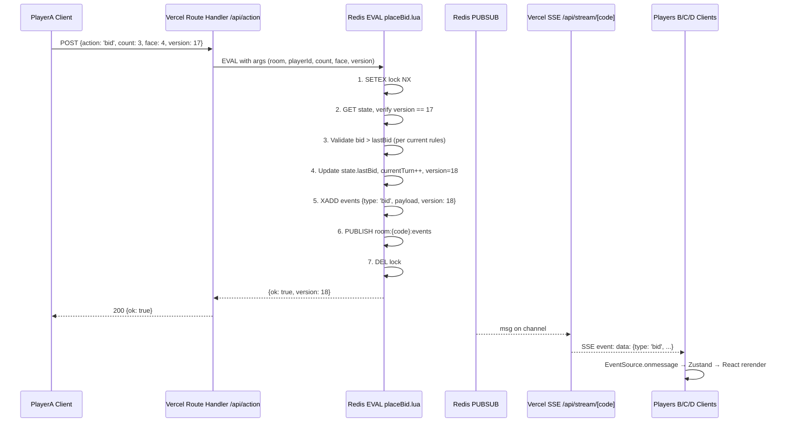

# 大话骰 Web App Demo — Design Spec

**Date**: 2026-05-21
**Status**: Design approved + multipass design review pass 1 done (5/10 → 9/10)
**Owner**: xingfanxia
**Slug**: `dahua-dice`
**Repo**: github.com/xingfanxia/dahua-dice (to be created)
**Deploy**: dahua-dice.vercel.app

## 1. Overview

A multiplayer 大话骰 (Liar's Dice) web app demo. 2-8 players in private rooms joined via 6-character invite codes. Mobile-first with 3D physics-based dice, gyroscope shake-to-roll with magnitude-coupled animation/audio/haptics, four switchable visual themes, and four dimensions of player customization (count / appearance / rules / avatar). Backed by Vercel Fluid Compute + Upstash Redis (state + Pub/Sub via REST SSE pipe).

This is the **Full Vision** tier (~12-14 day budget): demo-quality polish, not just a working prototype. Includes complete Chinese ruleset (斋, 1 点万能, 中式扩展 劈/反劈/通杀) and the Perudo Palifico variant.

## 2. Goal & Non-Goals

**Goal**: A polished, playable Liar's Dice demo that can be shared in WeChat / friend group via a link, plays smoothly on iPhone 12+ and Pixel 7+ Safari/Chrome, and feels visually distinctive (not "AI-generated UI").

**Non-Goals (out of scope)**:
- Public matchmaking lobby / ranked play
- Persistent player accounts (匿名 session 跨设备恢复 only)
- AI opponents
- Game replay / 战绩 history
- Real money / tournaments
- Native mobile app (web only, with PWA install)

## 3. User Decisions (Consolidated)

| Decision | Choice |
|---|---|
| 自定义维度 | 数量 + 外观 + 规则 + 玩家头像化（全部 4 维） |
| 房间机制 | 私房间，6 位码分享，2-8 人 |
| 设计风格 | 4 themes 全部支持（modern-minimal / classic-bar / hk-neon / cartoon） |
| 玩家身份 | 匿名昵称 + Upstash Redis session（URL token，跨设备恢复） |
| 语言 | 中文优先 + 英文备件切换（next-intl，zh-CN default） |
| GitHub | github.com/xingfanxia/dahua-dice (public) |
| Vercel | 现有账号，dahua-dice.vercel.app 默认域名 |
| 陀螺仪 | DeviceMotion API + 摇晃幅度联动动画 / 音效 / 触觉 |
| 音效 | 完整支持，4 theme 各一套 pack |
| Scope tier | 完整愿景（含中式扩展规则 + Palifico + PWA） |

## 4. Tech Stack

| Layer | Choice | Notes |
|---|---|---|
| Framework | Next.js 16 App Router + React 19 + TypeScript | |
| Deploy | Vercel Fluid Compute | maxDuration 800s for SSE (Pro tier) or 300s (Hobby) |
| State backend | Upstash Redis | Provisioned via Vercel Marketplace |
| Pub/Sub | Upstash REST `/subscribe/{channel}` SSE transparent pipe | No ioredis dep, zero TCP |
| Atomic ops | Redis Lua script + version CAS | HTTP API can't do WATCH/MULTI |
| 3D | `react-three-fiber@9.5.0` + `@react-three/rapier@2.2.0` | `onContactForce` for impact magnitude |
| Audio | `howler.js` v2 + audiosprite | 7KB, sprite pool, iOS autoUnlock |
| 3D audio | `@react-three/drei <PositionalAudio>` (optional) | Spatial fall-off for table sense |
| i18n | `next-intl` | zh-CN default + en |
| UI | Tailwind CSS v4 + shadcn/ui | |
| Client state | Zustand | Game UI / theme / settings local |
| Gyroscope | DeviceMotion API + `requestPermission()` (iOS) | |
| Haptics | `navigator.vibrate()` (Android only) | iOS Safari unsupported → louder audio fallback |
| PWA | Manual `public/manifest.json` + icons | iOS Add to Home Screen support; skip next-pwa (build complexity not needed for MVP) |
| Test | Vitest (game-engine unit) + Playwright (e2e via webapp-testing skill) | |
| Lint | Biome v2 | Faster than ESLint+Prettier |

## 5. Directory Structure

```
side-projects/dahua-dice/
├── app/
│   ├── page.tsx                       # 首页：昵称 + 创建/加入
│   ├── room/[code]/page.tsx           # 房间内 (lobby + game 单页, state-driven)
│   └── api/
│       ├── room/route.ts              # POST 创建 / GET 查询
│       ├── action/route.ts            # POST 叫数/开骰/摇骰 Server Action
│       └── stream/[code]/route.ts     # GET SSE long-lived connection
├── components/
│   ├── dice/
│   │   ├── DiceCanvas.tsx             # R3F Canvas wrapper
│   │   ├── DiceCup.tsx                # 骰盅 cylinder + 揭盅动画
│   │   ├── Dice.tsx                   # 单个骰子，可换贴图/颜色
│   │   └── PhysicsWorld.tsx           # Rapier physics setup
│   ├── game/
│   │   ├── PlayerRing.tsx             # 玩家圈布局
│   │   ├── BidPanel.tsx               # 叫数面板（数量×点数）
│   │   ├── ChallengeButton.tsx        # "开" 按钮
│   │   ├── RevealStage.tsx            # 揭骰动画+结果
│   │   └── RulesSummary.tsx           # Lobby 规则总览
│   ├── theme/
│   │   ├── ThemeProvider.tsx          # context + design tokens
│   │   ├── ThemeSwitcher.tsx          # 4 theme 切换
│   │   └── tokens.ts                  # 4 themes 的 oklch 色板 / 字体 / 资源 map
│   ├── customization/
│   │   ├── CustomizationDrawer.tsx    # 4 维度面板
│   │   ├── CountPicker.tsx            # 3-7 颗
│   │   ├── AppearancePicker.tsx       # 4 套预设
│   │   ├── RulesToggles.tsx           # 规则参数 switches
│   │   └── AvatarPicker.tsx           # 选骰子套装作 ID
│   ├── shake/
│   │   ├── useShakeDetector.tsx       # DeviceMotion hook + iOS permission
│   │   └── ShakePermissionGate.tsx    # iOS 首次提示 UI
│   └── ui/                            # shadcn/ui re-exports
├── lib/
│   ├── redis.ts                       # Upstash HTTP client + REST SSE helper
│   ├── game-engine.ts                 # 纯函数（叫数判定/斋规则/CAS），易测
│   ├── state-machine.ts               # phase 流转
│   ├── lua/
│   │   ├── placeBid.lua               # CAS + 状态更新
│   │   ├── challenge.lua              # 开骰判定
│   │   └── joinRoom.lua               # 防 race condition 入房
│   ├── audio/
│   │   ├── howl-instance.ts           # singleton Howl pool
│   │   ├── useDiceAudio.ts            # Rapier onContactForce + 摇晃 magnitude 映射
│   │   ├── ios-unlock.ts              # touchend/pointerup 三层 unlock
│   │   └── packs/                     # 4 theme 音效 sprite + json
│   ├── auth/
│   │   ├── session.ts                 # token 生成 + Redis session
│   │   └── nickname-validator.ts      # 防 XSS/敏感词
│   └── i18n.ts                        # next-intl config
├── messages/
│   ├── zh-CN.json                     # 规则文案 / UI / 错误
│   └── en.json
├── public/
│   ├── manifest.json                  # PWA
│   ├── icons/                         # PWA icons
│   ├── dice-textures/                 # 4 套外观贴图
│   └── audio/                         # 4 theme 音效 sprite
├── docs/
│   ├── research/                      # 4 份调研（done）
│   └── specs/                         # design.md + plan.md
└── tests/
    ├── game-engine.test.ts            # Vitest unit
    └── e2e/                           # Playwright
```

## 6. Routes & API Surface

| Method | Path | Purpose |
|---|---|---|
| GET | `/` | 首页：输入昵称 → 创建房间 OR 输入 6 位码加入 |
| GET | `/room/[code]` | 房间内（lobby + game，phase 驱动） |
| POST | `/api/room` | 创建房间 → 返回 code + ownerToken |
| GET | `/api/room/[code]` | 查询房间是否存在 + 是否可加入 |
| POST | `/api/action` | 玩家动作（join / start / roll / bid / challenge / leave），server-authoritative validation |
| GET | `/api/hand/[code]` | 拉取本人私有骰子（server filters by session token; only returns caller's hand pre-reveal） |
| GET | `/api/stream/[code]` | SSE 长连接，订阅 `room:{code}:events`（仅 public state） |
| GET | `/api/health` | Vercel health check |

**Server Actions vs Route Handlers**: Use Route Handlers (`/api/action/route.ts`) instead of Server Actions because we need explicit JSON RPC pattern + SSE streaming. Server Actions are convenient but reasoning about them with SSE pub/sub gets messy.

## 6A. Screen Information Architecture

Screen-by-screen ASCII wireframes. Visual hierarchy is explicit: what user sees **first** (Z1, dominant), **second** (Z2, supporting), **third** (Z3, utility/low priority).

### Home (`/`)

```
┌─────────────────────────────────────┐
│        大话骰                        │ Z1: title (5-sec visceral)
│        Liar's Dice                   │
│                                       │
│  [你的名字: ________]                 │ Z1: single primary input
│                                       │
│  ┌─────────────┐  ┌─────────────┐    │ Z1: two equal-weight CTAs
│  │ 创建房间    │  │ 加入房间    │    │
│  └─────────────┘  └─────────────┘    │
│                                       │
│  --[join expanded]--                  │
│  [ABC123] ← 6 个码，每格 1 字符,      │ Z2: paste-aware grid
│              支持粘贴整串             │
│  [→ 进入]                            │
│                                       │
│  ─────── (低于折叠线) ───────         │
│  主题 [modern-minimal ▾]  语言 [中▾] │ Z3: settings drawer trigger
└─────────────────────────────────────┘
```

### Room Lobby (`/room/[code]`, phase=lobby)

```
┌─────────────────────────────────────┐
│ 房间 ABC123  [📋 复制邀请码]         │ Z1: room ID + share
│ ─────────────────────────────────  │
│                                       │
│ 玩家 (3/8)                            │ Z1: roster (primary content)
│  ★ XingfanX (你, 房主) [熊猫]         │
│    LittleM [emoji]                    │
│    Cory [cyber]                       │
│  ⋯ 等待玩家加入                       │
│                                       │
│ ── 规则 ─────────────────────       │ Z2: rules summary (collapsible)
│ 每人 5 颗 · 1点万能 · 允许斋          │
│ [⚙ 修改规则] (仅房主)                 │
│                                       │
│ [▷ 开始游戏] (灰: <2 人 / 亮: ≥2)     │ Z1: primary CTA, state-aware
│                                       │
│ ─── 主题 │ 音效 │ 离开 ─────         │ Z3: utility row
└─────────────────────────────────────┘
```

### Game — Rolling Phase

```
┌─────────────────────────────────────┐
│ ABC123 · 第 3 局 · 摇骰阶段        ⓘ │ Z3: header strip
│                                       │
│ ┌── 其他玩家圈 ────────────────┐    │ Z2: peers' status
│ │ LittleM   Cory    Tony       │    │
│ │  摇骰中…  摇骰中…  ✓完成     │    │
│ └──────────────────────────────┘    │
│                                       │
│ ┌── 3D 骰子骰盅 (Canvas) ────────┐   │ Z1: dominant visual
│ │                                │   │
│ │      [骰盅 with 5 dice]        │   │
│ │      震动 + 物理 + 音效        │   │
│ │                                │   │
│ └────────────────────────────────┘   │
│                                       │
│ 💡 用力摇手机 / 或 [👆 点这里]        │ Z1: action prompt (thumb zone)
│                                       │
│ ── 你的骰子: [📖 长按查看] ────       │ Z2: peek your hand
└─────────────────────────────────────┘
```

### Game — Bidding Phase

```
┌─────────────────────────────────────┐
│ ABC123 · 第 3 局 · 等 LittleM 叫    │
│                                       │
│ ── 叫数链 ──────────────────       │ Z1: bid history (primary)
│  You "三个4"  →  LittleM (思考中…)   │
│                                       │
│ ┌── Dice Cup (小, idle) ────┐         │ Z2: secondary canvas
│ │     [骰子静态] [📖 peek]   │         │
│ └────────────────────────────┘         │
│                                       │
│ ── (当 LittleM = 你) ──────────       │ Z1: bid panel in thumb zone
│ 上家: "三个4"                         │
│ ┌────────────────────────────────┐   │
│ │ 数量  [—]  4  [+]              │   │
│ │ 点数  ⚀ ⚁ ⚂ ⚃ ⚄ ⚅            │   │
│ │       已选: ⚃                  │   │
│ │ □ 斋叫 (1 点不算)               │   │
│ │ ─────────────────────────     │   │
│ │ [叫 "四个4"]  (绿, validates)   │   │
│ │ [🔓 开!]  (红, dramatic)        │   │
│ └────────────────────────────────┘   │
└─────────────────────────────────────┘
```

**Bid panel design philosophy**: occupies bottom 35% of viewport (thumb-zone). "叫" (bid) is primary green CTA. "开!" (challenge) is red/danger, equal visual weight (because it's an equally valid move, not a "destructive" action — semantically different from delete buttons). The two are visually balanced, not "primary vs secondary."

### Game — Reveal Phase

```
┌─────────────────────────────────────┐
│ ABC123 · 揭晓!                       │
│                                       │
│ ┌── 3D scene (dramatic) ─────────┐   │ Z1: full-bleed
│ │                                │   │
│ │     骰盅打开 (Y+ 0.6s ease)     │   │
│ │     所有 dice 现身             │   │
│ │     ✨ confetti or 💀 fall      │   │
│ │                                │   │
│ └────────────────────────────────┘   │
│                                       │
│ ── 各家骰子 ─────────────────       │ Z2: hand summary
│ You    ⚂⚂⚄⚀⚀                       │
│ LittleM ⚁⚄⚂⚀⚄  ← 开骰者              │
│ Cory   ⚀⚂⚁⚄⚂                       │
│                                       │
│ ── 判定 ──────────────────────       │ Z1: outcome
│ 叫: "四个 4"   实际: 五个 4 (含1点)   │
│ 💀 LittleM 输一颗骰                  │
│                                       │
│ [3s 后继续下一局…]                    │ Z3: auto-advance
└─────────────────────────────────────┘
```

### Customization Drawer (slides from bottom, 80vh max)

```
┌─────────[─ drag handle ─]──────[X]──┐
│ 规则设定 (仅房主可改)                │
│                                       │
│ 🎲 骰子数 [— 5 +]                    │ Stepper, 3-7, tabular-nums
│   每人多少颗                          │
│                                       │
│ 🎨 外观                              │ Live-preview picker
│   ┌─┐ ┌─┐ ┌─┐ ┌─┐                  │
│   │1│ │🎲│ │一│ │AX│                │
│   └─┘ └─┘ └─┘ └─┘                  │
│   数字 emoji 汉字 品牌               │
│                                       │
│ ⚙ 规则                               │ Toggle switches
│   [√] 1点万能                        │
│   [√] 允许斋                         │
│   [ ] 中式扩展 (劈/反劈/通杀)         │
│   [ ] Palifico 海外变体              │
│                                       │
│ 🃏 玩家头像化                        │
│   每个人选自己的骰子套装作 ID         │
│   [→ 进入玩家自选]                    │
│                                       │
│   [√ 保存]      [X 取消]              │
└─────────────────────────────────────┘
```

### Settings Drawer (从右滑入, in-game accessible)

```
┌─────────────────────[X]─┐
│ 设置                      │
│                           │
│ 主题切换                  │
│  [● modern-minimal ]      │
│  [○ classic-bar    ]      │
│  [○ hk-neon        ]      │
│  [○ cartoon        ]      │
│                           │
│ 音效                      │
│   音量 [────●──] 70%       │
│   [ ] 静音                │
│                           │
│ 语言                      │
│   [● 中文] [○ English]    │
│                           │
│ 陀螺仪                    │
│   [√ 已授权] (or 点击授权) │
│                           │
│ ─── 退出房间 ───          │
└───────────────────────────┘
```

## 7. Data Model (Redis Schema)

| Key | Type | Content | TTL |
|---|---|---|---|
| `room:{code}:state` | JSON String | `{ phase, players[], currentTurn, lastBid, isZhai, round, version, rules, theme }` | 6h, 30m if lobby |
| `room:{code}:hands` | Hash | `playerId → encrypted dice values JSON` | 6h (server-only, only revealed on challenge) |
| `room:{code}:events` | Redis Stream (XADD) | Event log: `{ type, payload, timestamp, version }` | 6h, capped at 200 events |
| `room:{code}:lock` | String | Lua mutex for CAS critical section | 5s NX |
| `session:{token}` | JSON String | `{ playerId, nick, currentRoom, theme, avatar, customization, createdAt }` | 24h |
| `room:{code}:nicks` | Hash (within room) | `lowercased_nick → playerId` (uniqueness scoped to room, not global) | 6h |

**Versioning (optimistic lock)**: `room:{code}:state` includes a `version` integer. Every Lua write checks `incoming.expected_version === current.version` and bumps it. Conflict → returns 409 to client; client re-fetches and retries.

**Encryption of hands**: server keeps a server-only AES-256-GCM key in Vercel env var. `hands` are stored encrypted so even if Redis is dumped, dice values aren't exposed pre-reveal. Decrypted only at `challenge` phase to fan out to all clients.

**Free tier capacity check** (Upstash 2025 plan = 500K commands/month):
- Per game: ~50-200 commands per player turn (state read + write + publish + event XADD)
- A 4-player 30-round game: ~80 turns × ~6 cmds = ~480 commands
- Demo budget: 1000 games / month = 480K commands ≈ at limit
- Headroom: if exceeded, upgrade to Pay-as-you-go @ $0.20 / 100K commands

## 8. State Machine

```
                       ┌─────────┐
                       │  lobby  │ ← create_room
                       └────┬────┘
                            │ all_ready (≥2 players, owner start)
                            ▼
                       ┌─────────┐
                  ┌───►│ rolling │ ← each player rolls (server-side seed)
                  │    └────┬────┘
                  │         │ all_rolled
                  │         ▼
                  │    ┌─────────┐
                  │    │ bidding │◄──┐ next_bid
                  │    └─┬─────┬─┘   │
                  │      │     │ challenge
                  │      └─────┴────►┌─────────┐
                  │                  │ reveal  │ (broadcast hands)
                  │                  └────┬────┘
                  │                       │ resolve (loser -1 die)
                  │                       ▼
                  │                  ┌──────────┐
                  │                  │round_end │
                  │                  └─┬────────┘
                  │ alive ≥ 2          │ alive ≤ 1
                  └─────────────────── │
                                       ▼
                                  ┌──────────┐
                                  │ game_end │
                                  └──────────┘
```

Phase transitions are server-authoritative. Client gets phase from SSE and renders accordingly.

## 9. Data Flow (PlayerA places a bid)



**Failure modes**:
- Lock held: Lua returns `{ok: false, reason: 'busy'}` → client retries with backoff
- Version mismatch: Lua returns `{ok: false, reason: 'stale'}` → client refetches state and retries
- Invalid bid: Lua returns `{ok: false, reason: 'invalid_bid', detail}` → client shows toast
- SSE disconnect: client EventSource auto-reconnects; on reopen, fetch latest state + events since `lastEventId` from Redis Stream

## 10. Game Engine Logic (in `lib/game-engine.ts`)

Pure functions, no Redis dependency, fully unit-tested. All gameplay rules live here.

```ts
type Bid = { count: number; face: 1 | 2 | 3 | 4 | 5 | 6; isZhai: boolean };
type GameRules = {
  diceCount: 3 | 4 | 5 | 6 | 7;       // each player's dice
  aceWild: boolean;                    // 1 点是否万能（仅非斋叫时）
  allowZhai: boolean;                  // 是否允许斋叫
  startingBidFactor: number;           // default 1.5 → ceil(1.5 × N)
  diceSides: 6 | 8;                    // D6 (default) or D8 progressive
  chineseExtensions: {                 // 中式扩展
    pi: boolean;                         // 劈
    fanpi: boolean;                      // 反劈
    tongsha: boolean;                    // 通杀
  };
  paliFicoVariant: boolean;            // 海外 Perudo Palifico (剩 1 骰特殊回合)
};

function isValidBid(prev: Bid | null, next: Bid, rules: GameRules, alivePlayers: number): ValidationResult;
function resolveChallenge(bid: Bid, allHands: Hand[], rules: GameRules): ChallengeResult;
function applyChineseExtension(action: ChineseExtAction, state: GameState): GameState;
```

**Key rules implemented**:
- 起叫数 = `ceil(rules.startingBidFactor × alivePlayers)`，斋叫为 `alivePlayers`
- 加叫合法性：`count > prev.count` OR (`count === prev.count && face > prev.face`)
- 斋后破斋（飞）：`next.count >= prev.count × 2`
- 进入斋（中途转斋）：只需满足普通加叫规则（research §2.3），NO halve-pool 限制
- 叫1必斋：`face === 1` 必须为斋叫（research §2.3）
- 1 点万能：非斋叫且非 Palifico 时算 `face` + `1` 点，斋叫/Palifico 时只算 `face`
- 防作弊：叫数不得超过场上骰子总数

### 10B. 中式扩展 + Palifico — pinned semantics

Implemented in `lib/game-engine/round.ts` (pure, unit-tested) and run by the API
route in Node, committed atomically via a thin version-CAS Lua (`commitState` /
`commitRound`). There is **no** separate untested Lua re-implementation of the
rules. Semantics (derived from research §3.6 / §3.4, pinned here as the contract):

- **开 (Dudo)**: challenge the standing bid (last `bidChain` entry). actual ≥ count
  → challenger loses 1 die; actual < count → bidder loses 1.
- **劈 (Pi / 跳杀)** `chineseExtensions.pi`: skip the predecessor and challenge a
  *non-adjacent* chain bidder's bid. That bid false → target loses 1; true →
  splitter loses 1.
- **反劈 (Fanpi)** `chineseExtensions.fanpi` (depends on pi): a failed 劈 (target's
  bid held) escalates the splitter's loss to 2 dice — the "bite back".
- **通杀 (Tongsha / 连开)** `chineseExtensions.tongsha`: challenge the standing bid;
  false → every other chain bidder loses 1 (sweep); true → the 通杀er loses 2.
- **Palifico** `paliFicoVariant`: the first time a player drops to exactly 1 die,
  the next round is theirs to open; 1s are not wild; the count is locked to the
  opener and raises are face-only. One-shot per player. If several drop at once,
  the round loser opens.

## 10A. Interaction State Matrix

Every feature spec'd across 5 states. "Empty" / "loading" / "error" are first-class designs, not afterthoughts.

| Feature | Loading | Empty | Error | Success | Partial / Edge |
|---|---|---|---|---|---|
| Home → 创建房间 | Spinner in btn @ 200ms; full-screen @ >500ms | N/A | Toast "网络错误，重试？" + retry; ICP block / rate limit: explain | Auto-nav `/room/[code]` w/ slide-up transition | Optimistic: show code instantly, validate async |
| Home → 加入房间 | Spinner in btn | Placeholder "输入 6 位邀请码" | Inline: "房间不存在" / "已满" / "游戏中无法加入" / "已结束" | Auto-nav to room | <6 chars: hint "再 N 位"; paste detected: auto-fill all 6 |
| Lobby — 等待玩家 | Shimmer on empty slots | "等待 ≥2 人才能开始，邀请朋友吧 [📋 复制链接]" | Banner "重新连接中…" w/ spinner | When ≥2 → "开始游戏" CTA glows | N joined, M empty: "⋯ 等待 M 人" |
| Lobby — 改规则 | Spinner on save btn | N/A | "无权限" (非房主) toast | Drawer dismisses + chip "规则已更新" | 房主离线: 自动转交下一位最早加入 |
| Roll dice (摇骰) | Dice cup shake + "其他玩家摇骰中" | N/A | Permission denied iOS: fallback "点这里摇" | 5 dice settled @ onSleep, 骰盅恢复 | 部分玩家完成: 显示 ✓ marker per player |
| Bid (叫数) | Spinner in btn (200ms guard) | N/A | Inline below panel: "必须 ≥'三个4'" w/ shake animation | Bid added to history, turn passes w/ animated transition | Count unchanged, face up: highlight face diff arrow |
| Challenge (开) | 800ms dramatic suspense pause + drumroll sound | N/A | Toast "操作失败" | Cup lifts (Y+0.6s) + dice reveal | Reconnect mid-suspense: skip to result state |
| Reveal | Skeleton hands for ~200ms | N/A | Network drop: show last-known server-pushed result | All hands shown + confetti/💀 + outcome text | Reconnect mid-reveal: skip to result state |
| Theme switch | Brief 200ms fade | N/A | "主题加载失败，已回滚" toast | Scene reloads w/ new theme; persist to localStorage + Redis session | Audio pack lag: continue old until loaded |
| Customization save | Spinner on save btn | N/A | "保存失败，规则未生效" | Drawer dismiss + toast "规则已保存" | Mid-game: error "游戏中无法修改" |
| Avatar picker | N/A | "你还没选骰子套装" w/ "随机分配" 兜底 btn | N/A | Chip 显示选中套装 | 套装重复: 房主可以允许 / 强制每人不同 |
| Connection drop (any) | Subtle banner "重新连接中…" appears < 3s | N/A | After 30s offline: full-screen "已断开，请检查网络 [重新加入]" | Auto-recovery: banner fades, state syncs from `room:{code}:events` Stream | Other players see "PlayerX 网络异常" tag |
| Session expiry | N/A | N/A | "会话已过期，请重新输入昵称" w/ redirect to `/` | Auto-renew if active | Cross-device: 警告"另一设备登录" |

**Empty states are features**, not "no items found." Every empty state has: warmth (one-liner explanation), primary action (what to do next), context (why this is happening).

## 11. 3D Dice System

**Stack**: `react-three-fiber@9.5.0` + `@react-three/rapier@2.2.0` + `@react-three/drei` for helpers.

**Scene**:
- Camera: orthographic, top-down 30° tilt (mobile-friendly proportions)
- Lighting: ambient + 1 directional (avoid expensive shadow maps; use baked AO if needed)
- Cup: `cylinderGeometry` invisible at start, animates to side on reveal
- Dice: 5 (or rules.diceCount) `RigidBody` `cuboid`s, BoxGeometry with 6 face textures
- Floor: invisible plane at y=0 (collision boundary)

**Lifecycle**:
1. **Idle**: dice stacked in cup at fixed positions (no physics, just `<mesh>`)
2. **Rolling triggered** (shake/click): switch dice to `RigidBody` mode, apply randomized angular + linear velocity (scaled by gyroscope magnitude or button default), enable physics
3. **Settling**: physics runs, `onSleep` callback fires per die; when all 5 sleep, read top face via raycast or quaternion → store result
4. **Private view**: client receives encrypted hand for self only; renders top face up
5. **Reveal**: when `phase === 'reveal'`, server broadcasts all hands; cup lifts off (Y+animation 0.6s ease-out), all dice show

**Mobile perf budget**:
- Three.js bundle ~155KB gz, Rapier WASM ~70-100KB gz; total ~180KB first paint
- Dynamic import: `dynamic(() => import('./DiceCanvas'), { ssr: false })`
- Pixel ratio cap: `min(devicePixelRatio, 2)`
- Disable AA on low-end (detect via `gl.capabilities.maxTextures < 16`)
- Min height: `min-h-[100dvh]` (NOT `100vh` due to iOS Safari viewport jump)
- Fallback: if `!window.WebGL2RenderingContext`, swap to 2D SVG dice (graceful degrade)

## 12. Theme System

4 design themes, each defines a complete token set. Switching theme reloads 3D scene assets + audio pack without page refresh.

| Theme key | Background | Primary | Accent | Display font | UI font | Dice material | Audio pack |
|---|---|---|---|---|---|---|---|
| `modern-minimal` | `oklch(0.12 0.02 250)` | `oklch(0.7 0.15 230)` | `oklch(0.75 0.18 50)` orange | Space Grotesk | Inter | Frosted glass / brushed metal | Metal/glass clinks |
| `classic-bar` | `oklch(0.25 0.04 60)` 酒红木 | `oklch(0.55 0.15 50)` caramel | `oklch(0.85 0.12 80)` cream | Newsreader | Outfit | Ivory + black pips | Wood/leather thuds |
| `hk-neon` | `oklch(0.15 0.04 320)` | `oklch(0.7 0.25 340)` magenta | `oklch(0.85 0.18 200)` cyan | 华康新综艺 (web font fallback Noto Serif TC) | Outfit | Fishball hand-drawn pips | 港式市井 ambience |
| `cartoon` | `oklch(0.95 0.03 70)` peach | `oklch(0.75 0.15 30)` peach | `oklch(0.7 0.18 150)` mint | Plus Jakarta Sans | Plus Jakarta Sans | Soft dice with eyes | Q版 啵啵 bops |

**Token shape** (in `components/theme/tokens.ts`):
```ts
type ThemeTokens = {
  key: 'modern-minimal' | 'classic-bar' | 'hk-neon' | 'cartoon';
  colors: { bg, surface, primary, accent, text, textMuted, success, danger };
  fonts: { display, ui };
  dice: { textureSetUrl, material: 'glass' | 'ivory' | 'painted' | 'soft' };
  audioPackUrl: string;
  ambient?: string; // optional background loop
};
```

Default theme: `modern-minimal` (best matches 3D + mobile-first showcase).

### Per-theme UI patterns (anti-slop specificity)

Each theme has a distinctive motion + interaction language. Buttons / dice cups / transitions feel DIFFERENT across themes, not just recolored.

| | modern-minimal | classic-bar | hk-neon | cartoon |
|---|---|---|---|---|
| **Logo treatment** | Type-only, blue→white gradient, subtle outer glow | 古风篆刻"大話骰"印章红章 | 华康字 + 霓虹光晕 + slight CRT flicker | 圆角字 + 骰子角色作 "0" |
| **Button hover/press** | Glass-morph w/ orange accent edge; spring-back press | Solid color, no gradient; heavy 4px shadow drop on press | Pixel border (2px), magenta glow on hover, flicker on press | Inflated 3D, squish-bounce on press |
| **Dice cup material** | Brushed metal cylinder w/ subtle reflections | Leather-wrapped wood w/ stitched seam | Enamel-coated tin (港式茶餐厅风) | Pastel ceramic w/ ribbed texture |
| **Transition motion** | 200ms ease-out, slight Y-translate | 300ms slow fade w/ warmth | 250ms slight overshoot + scanline pass | 350ms spring w/ bounce |
| **Confetti / 💀 style** | Geometric particles (triangles, glow) | Wood chips + leaf flutter | Neon 流星 + 红包 | 软糖星星 + 心形泪 |
| **Cursor / focus ring** | Cyan outline 2px | Brass outline w/ shadow | Magenta + cyan double ring | 粉色虚线 + 弹性 |
| **Empty-state illustration** | Geometric abstract | 牛仔风 sketch | 港式画风 (李志清 / 王司马) | 厦门浪花动漫 inspired |

These differences should be felt within 5 seconds of switching theme. Use this as the test: if a screenshot of theme A and theme B can be told apart with brightness removed, it's working.

## 13. 4 维度自定义 (in `CustomizationDrawer`)

Only the room owner can change params during `lobby`. Locked once `start_game` is triggered.

| Dimension | Control | Range / Default | Affects |
|---|---|---|---|
| **数量** (diceCount) | Slider 3-7 | default 5 | game balance, starting bid threshold |
| **外观** (textureSet) | 4-card picker | default theme-recommended | Dice face textures only |
| **规则** (rules toggles) | Switches | aceWild=true, allowZhai=true, chineseExtensions.{pi,fanpi,tongsha}=false, paliFicoVariant=false, diceSides=6 | gameplay validity functions |
| **玩家头像化** (per-player avatar) | Pre-game per-player picker | choose from 4 texture sets | identifies whose dice on reveal |

**Texture sets** (8 packs total, all 4 themes can use any):
- `numeric` — 1-6 standard
- `emoji` — 🎲🎉🎯🎰🍻🐲 (6 themed)
- `hanzi` — 一二三四五六
- `brand` — custom logo set (placeholder for v2 user upload)
- `panda` — 熊猫表情 (special: each face is a different panda emoji)
- `tavern` — 古风酒杯 / 麻将 / 酒坛子 / 骰盅 / 铜钱 / 骰子
- `kawaii` — pink hearts / stars / clouds / cats
- `cyber` — neon glyphs

## 14. 陀螺仪 + 摇骰联动

**iOS permission flow**:
```
First load → "用力摇手机来甩骰子！" prompt button
  → User taps → DeviceMotionEvent.requestPermission()
    → 'granted' → save flag to localStorage, attach listener
    → 'denied' / 'default' → show fallback "点这里摇骰" button
```

**Magnitude calculation** (60Hz):
```ts
const m = Math.sqrt(x*x + y*y + z*z) - 9.8;  // subtract gravity (~9.8 m/s²)
const intensity = clamp((m - 12) / (37 - 12), 0, 1);  // normalize 12-37 m/s² to 0-1
```

Idle ~0, gentle shake ~0.2, strong shake ~0.8-1.0.

**Coupling** (4 outputs from `intensity`):
1. **Physics**: `dice.applyImpulse({ x: r() * intensity * 8, y: 0, z: r() * intensity * 8 })`; angular `r() * intensity * 30`
2. **Shake duration**: 300ms (intensity=0) → 2000ms (intensity=1)
3. **Audio**: 骰盅震动音 volume = `0.4 + intensity × 0.6`; pitch (playbackRate) = `0.9 + intensity × 0.4`
4. **Haptics** (Android): `navigator.vibrate(50 + intensity × 150)`; iOS unsupported → reinforce audio

**Anti-spam**: peak detection — only commit a "shake event" if intensity stays above 0.4 for ≥150ms.

## 15. 音效系统

**Library**: Howler.js v2 + audiosprite (合并到 ~120KB/theme sprite file).

**Triggers**:
| Event | Source | Mapping |
|---|---|---|
| 摇骰盅 持续音 | Howl sound + loop | volume + pitch ← gyroscope intensity |
| 骰子碰撞 (Rapier `onContactForce`) | sprite slice | volume = `clamp(totalForceMagnitude / 50, 0.1, 1.0)`; pitch = random ±0.15 |
| 骰子落定 (`onSleep` all) | sprite slice | fixed volume 0.6 |
| 揭盅 | sprite slice | fixed 0.7 |
| 叫数确认 / UI 点击 | sprite slice | 0.5 |
| 开骰 dramatic stinger | sprite slice | 0.9 |
| 胜利 / 失败 | sprite slice | 0.8 |
| Theme ambient loop | Howl loop | 0.3 (user-mutable) |

**iOS unlock pattern** (3-layer fallback in `lib/audio/ios-unlock.ts`):
1. Howler's built-in `autoUnlock: true` (handles 95% of cases)
2. Manual `Howler.ctx.resume()` on first `pointerup` or `touchend` (iOS 17 bug workaround)
3. If still suspended, show muted icon → user tap → explicit resume

**Concurrent cap**: max 6 sounds playing at once (Howler pool); excess: oldest evicted.

**Debounce dice-collision sounds**: if same dice pair re-collides within 80ms, skip (avoid machine-gun effect during settling).

**Resources** (CC0 / Pixabay, urls in `docs/research/dice-audio-research.md`):
- Primary: Freesound `eduardvlog #766177` (full shake→roll→clatter chain) + `Code_E #575155`
- UI: Pixabay button clicks
- AI tier: ElevenLabs Sound Effects prompts for cartoon Q-pop and modern-minimal glass clinks (theme-specific where Freesound is weak)

## 16. i18n

**Library**: `next-intl`. Setup: `messages/zh-CN.json` (default) + `messages/en.json`.

**Coverage**: all UI text, game phase labels, error toasts, rule descriptions, theme names, customization labels.

**Routing**: locale via cookie + Accept-Language header (no `/zh/` URL prefix for cleaner URLs; explicit switcher in settings drawer).

**Game internal logic** (state machine, server) is locale-agnostic. Only render layer is localized.

## 17. Security Model

**Anti-cheat**:
- Dice values stored encrypted server-side (`room:{code}:hands` AES-256-GCM, key from Vercel env var)
- Server-side seed for dice rolls (`crypto.randomInt`), never trust client roll
- Private hand delivery: client polls `GET /api/hand/[code]` after each roll; server filters by session token and returns only caller's hand
- Public state (phase / bids / players) via SSE broadcast; **NO private hand data on SSE channel**
- Reveal phase: server explicitly broadcasts all hands via `room:{code}:events` (`{type: 'reveal', allHands: {...}}`)
- Bid validation in Lua (server-authoritative) — client can't submit illegal bids
- playerId = `crypto.randomUUID()` v4; session token = `crypto.randomBytes(32)` base64url

**Anti-abuse**:
- Nickname: max 20 chars, validated for XSS / NUL / sensitive word filter (lightweight, regex-based)
- Room code: 6 alphanumeric (excluding O / 0 / I / 1 / L for clarity), collision retry on create
- Rate limit: 30 actions / minute per session (Upstash counter)
- Session token: 32 bytes from `crypto.randomBytes`, stored httpOnly cookie + URL param for cross-device

**Privacy**:
- No PII collected (anonymous nicknames only)
- Session expires 24h after last activity
- Room expires 6h, lobby 30m if no start
- Vercel Web Analytics enabled (anonymized page views only)

## 17A. User Journey Storyboard

12 emotional checkpoints, with the spec mapping to support each.

| # | User does | User feels | Spec specifies |
|---|---|---|---|
| 1 | Lands on `/` | Curiosity + low friction | Theme accent visible immediately, single input, no signup |
| 2 | Enters nickname | Confidence | Validation inline (no popups), placeholder hint |
| 3a | Creates room | Ownership ("my room") | Code prominent, 1-tap copy, Web Share API on mobile |
| 3b | Joins room | Anticipation | Auto-advance digits, paste detection |
| 4 | Lobby — waits for friends | Excitement | New-player slide-in animation, soft chime, optimistic UI |
| 5 | Owner taps 开始游戏 | Tension building | "3...2...1...摇骰!" countdown overlay, theme-specific |
| 6 | Rolls dice | Engagement / fun | 3D physics + sound + haptics + visual response coupled to shake intensity |
| 7 | Peeks at own hand | Strategic thinking | Long-press to peek, release to hide (private to your screen) |
| 8 | Watches bid chain | Suspense | Bid chain visualized w/ player avatars, turn timer dot pulses |
| 9 | Own turn arrives | High agency moment | Bid panel slides into thumb zone, both 叫 and 开 equally accessible |
| 10 | Taps 开! | High stakes drama | Dramatic stinger sound, 800ms suspense pause, screen vignette darken |
| 11 | Cup lifts, reveal | Reward / disappointment | Cup-lift animation theme-specific (geometric / wood / neon / soft), confetti or 💀 |
| 12 | Game ends | Closure | Winner spotlight + share screenshot CTA + 再来一局 / 解散房间 |

### Time-horizon design

- **5-sec visceral**: "this isn't another generic AI app" — guaranteed by theme accent, custom logo, no Inter/Lucide
- **5-min behavioral**: bid panel rhythm + dice physics + audio loop = "I get this, this is satisfying"
- **5-year reflective**: "remember when we played 大话骰 in WeChat after dinner?" — emotional anchor via sound design + theme

## 17B. Component Vocabulary

Reusable building blocks, all themeable through `ThemeProvider` tokens.

| Component | Purpose | Notes |
|---|---|---|
| `<PrimaryButton>` | Main CTA | bg=primary, ≥44px tap target, theme-specific press motion |
| `<DangerButton>` | 开/挑战 | bg=danger; visually equal weight to PrimaryButton (semantically equally valid, not destructive) |
| `<StepperInput>` | 数量 / 数字 | Native +/- buttons, tabular-nums |
| `<DigitInput>` | 6-码逐字符 grid | Auto-advance, paste detection, all-uppercase |
| `<PlayerChip>` | Roster entry | Avatar (套装颜色) + name + ✓/⋯/💀 status indicator |
| `<BidChip>` | Bid in history list | "X 个 ⚄" w/ player avatar prefix, entry animation |
| `<RoomCodeDisplay>` | 6-char invite | Monospace, large (text-3xl), copy btn + share btn |
| `<Drawer>` | Slide-in panel | shadcn/ui drawer; 80vh max; drag-handle to dismiss |
| `<Toast>` | Non-blocking feedback | shadcn/ui sonner; theme-colored bg |
| `<DiceFace>` | 2D fallback or in chip | SVG, theme texture-set rendered |
| `<TurnTimer>` | 30s countdown (configurable on/off) | Circular SVG progress; danger color in last 5s |
| `<EmptyState>` | Standard empty pattern | Illustration (theme-specific) + headline + sub + primary action |
| `<ErrorBanner>` | Connection lost | Slim top banner, theme-colored danger w/ retry |
| `<RevealOverlay>` | Reveal moment | Full-bleed overlay, confetti/💀 particles, theme-specific |

## 17C. Responsive & Accessibility Spec

### Viewports

| Viewport | Spec |
|---|---|
| **Mobile portrait 375-430px** | Primary target. iPhone 12 / iPhone 14 Pro / Pixel 7. All wireframes calibrated here. |
| **Mobile landscape** | Degraded but usable: dice canvas centered (50% width left), panels stacked right |
| **Tablet portrait 768-834px** | Same layout as mobile, scaled up; dice canvas slightly larger |
| **Tablet landscape** | Like mobile landscape but more breathing room |
| **Desktop ≥1024px** | "Demo mode": center on viewport, max-width 480px, dark surround. Not optimized for mouse play but doesn't break. |

### Touch targets

- Minimum: 44 × 44 px (Apple HIG)
- Critical actions (叫 / 开 / 摇骰): ≥ 56 × 56 px
- Edge guard: keep CTAs ≥ 16px from screen edge (one-handed reach)

### Keyboard navigation

- Tab order on `/`: nickname → 创建 / 加入 toggle → join code (6 inputs) → submit → settings
- In game:
  - `1-6` keys: select dice face for bid
  - `+` / `-`: count up/down
  - `Enter`: submit bid
  - `Space`: challenge (with confirm modal to prevent fat-finger)
  - `Esc`: close any drawer
- Focus ring per theme (see Per-theme UI patterns)

### Screen readers (VoiceOver / TalkBack)

- ARIA live regions for game phases: "Player B 叫了 four 4s", "Reveal phase, you won, LittleM lost a die"
- Dice values announced on peek (not visually only)
- Player turn announced on transition
- Bid chain readable as a list

### Color contrast

All text ≥ 4.5:1 (WCAG AA). All 4 themes calibrated at design-token level (`oklch` lightness deltas) for AA compliance. Run automated check in CI: Axe / lighthouse-ci.

### Reduced motion (`prefers-reduced-motion`)

- Disable shake animation visuals (keep audio + haptics)
- Skip cup-lift animation, instant reveal
- Skip confetti particles
- Static dice (no spin), just face change
- Theme transitions: instant, no fade

### Safe area

- `padding-top: env(safe-area-inset-top)` for header
- `padding-bottom: env(safe-area-inset-bottom)` for bid panel
- iPhone Dynamic Island: don't put critical UI in top 60px on `min-h-[100dvh]` containers

### Forced colors (Windows high contrast)

- SVG dice → outline-only mode
- Theme colors → system colors

### Reduced data (`Save-Data` header)

- Skip ambient background audio loop
- Lower-res dice textures
- Static (non-animated) confetti

## 18. Roadmap (12-14 days)

| Day | Phase | Deliverable |
|---|---|---|
| 1 | **Setup** | dir / gh repo / Vercel link / Upstash provision via Marketplace / Next.js 16 scaffold / Tailwind / Biome / 4-theme tokens / next-intl skeleton |
| 2 | **Auth + session** | 匿名昵称 + URL token + Upstash session + 跨设备恢复 + i18n switcher |
| 3 | **房间创建** | POST /api/room + GET /api/room/[code] + 6 位码生成 + lobby UI |
| 4 | **SSE + polling fallback** | /api/stream/[code] SSE pipe + EventSource hook + 2-tab manual e2e |
| 5 | **3D dice core** | R3F Canvas + Rapier physics + 5 dice + 骰盅 cylinder + onSleep 检测 |
| 6 | **摇骰动画 + 揭盅** | 摇骰 lifecycle (idle / rolling / settling / private / reveal) |
| 7 | **DeviceMotion + 触觉** | iOS permission gate + magnitude calc + 4-way coupling |
| 8 | **Gameplay 1**: 叫数 + 开骰 | game-engine.ts pure functions + Lua placeBid/challenge + 状态机 + Vitest |
| 9 | **Gameplay 2**: 斋 + 1点万能 + 中式扩展 | full rule set + customization toggles |
| 10 | **主题切换** | 4 themes 全部接入 + 自定义参数 drawer + AvatarPicker |
| 11 | **音效系统** | Howler + audiosprite × 4 packs + onContactForce 接入 + 陀螺仪联动 + iOS unlock |
| 12 | **玩家头像化** | 套装 ID + 开骰时按套装颜色识别 |
| 13 | **PWA + 多设备测试** | manifest + iOS Add to Home Screen + Playwright e2e + chrome-devtools-mcp 截图 sweep |
| 14 | **Polish + 部署** | Lighthouse pass + bug fix + production deploy + share link |

## 19. Test Strategy

**Unit (Vitest)**:
- `lib/game-engine.ts` 100% coverage on bid validation, challenge resolution, zhai rules, 1 点万能, 中式扩展
- `lib/state-machine.ts` transition coverage

**Integration (Vitest + msw + mocked Upstash)**:
- Route Handlers (room create, action, stream)
- Lua scripts via Upstash test container (or mock Lua eval)

**E2E (Playwright via `webapp-testing` skill)**:
- Happy path: create room → 2 tabs join → start → roll → bid → challenge → reveal → round_end
- Edge: disconnect mid-game → reconnect with state restore from `room:{code}:events` Stream
- 4 themes screenshot regression
- Mobile viewport: iPhone 14 Pro + Pixel 7 + iPad (via `chrome-devtools-mcp emulate_device`)

**Manual real-device** (requires xingfanxia):
- iPhone gyroscope shake + permission grant flow
- Android Chrome haptics
- Both safe-area / notch / dynamic island

## 20. TBD / Out-of-MVP / Future Scope

- AI opponents (probability-based bid + bluff)
- 战绩 history / persistent accounts (NextAuth.js)
- 大厅匹配 / 排位
- 游戏录像 / 回放
- 用户上传自定义骰子贴图
- 多语言扩展 (粤语 / 日 / 韩 / 西班牙)
- Real-time spectator mode
- WeChat sharing card

## 21. Anti-AI-Slop Visual Discipline

Per `~/.claude/CLAUDE.md` design routing rules, all UI must avoid:

- **Fonts**: no Inter / Roboto / Arial / Helvetica / Open Sans / system-ui as display
- **Colors**: no purple→pink default gradients; no cyan-on-dark stock palettes; no gradient text on metrics; no `#000` / `#fff` (use `oklch(0.12 0.02 250)` / `oklch(0.95 0.03 70)`)
- **Layout**: no centered-everything; no 3-col icon-in-circle grids; no "hero metric" template; no glassmorphism-everywhere
- **Copy**: no Lorem Ipsum; no Title Case On Every Header; no "Elevate / Seamless / Unleash"; no fabricated player counts
- **Tech**: `min-h-[100dvh]` not `100vh`; Phosphor / Heroicons / Radix (NO Lucide); animate transform/opacity only (NOT top/left/width/height); `tabular-nums` for any number display

## 22. References

- `docs/research/dahua-dice-research.md` — game rules (24KB)
- `docs/research/multiplayer-sync-research.md` — Upstash + Vercel + SSE (26KB)
- `docs/research/dice-3d-animation-research.md` — R3F + Rapier + mobile perf (49KB)
- `docs/research/dice-audio-research.md` — Howler + Freesound + iOS unlock (25KB)
- Project layout rules: `~/projects/CLAUDE.md`
- Global engineering standards: `~/.claude/rules/engineering.md`, `~/.claude/rules/workflow.md`

## 23. Design Review Log

| Pass | Dim | Before | After | Notes |
|---|---|---|---|---|
| 1 | Information Architecture | 4/10 | 9/10 | Added §6A screen wireframes (Home/Lobby/Rolling/Bidding/Reveal/Customization/Settings drawers) w/ Z1-Z3 visual hierarchy |
| 2 | Interaction State Coverage | 3/10 | 9/10 | Added §10A state matrix (12 features × 5 states each): loading/empty/error/success/partial; empty states are features |
| 3 | User Journey & Emotional Arc | 2/10 | 9/10 | Added §17A 12-step storyboard + time-horizon design (5-sec/5-min/5-year) |
| 4 | AI Slop Risk | 6/10 | 8/10 | Added §12.x per-theme UI patterns (button/cup/transition/confetti) — each theme has distinctive motion+interaction language |
| 5 | Design System Alignment | 5/10 | 8/10 | Added §17B component vocabulary; no DESIGN.md but tokens defined per-theme; flagged DESIGN.md as Phase 2 |
| 6 | Responsive & Accessibility | 3/10 | 9/10 | Added §17C viewports/keyboard nav/screen readers/contrast/reduced motion/safe area/forced colors/save-data |
| 7 | Unresolved Decisions | — | — | All major resolved inline; PWA next-pwa vs manual → manual; Server Actions vs Route Handlers → Route Handlers; nick uniqueness → within-room; private hand delivery → separate `/api/hand/[code]` endpoint, NOT on SSE |

**Overall**: 5/10 → 9/10. Plan is design-complete; ready for implementation plan.
